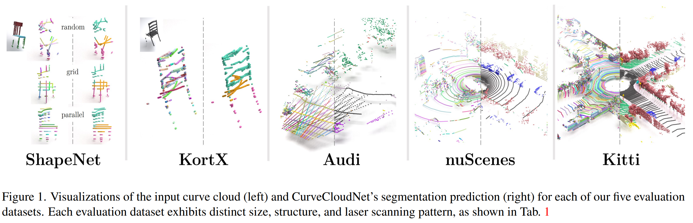

# CurveCloudNet: Processing Point Clouds with 1D Structure




## Installation

#### Python Environment
For quick installation, install [anaconda](https://www.anaconda.com/) and run `bash setup.sh ANACONDA_PATH ENV_NAME`. For example,
`bash setup.sh /home/colton/anaconda3 curvenet`.

This repo was tested on Ubuntu 20.04 with Cuda 11.7 and PyTorch 2.0. The external package FRNN does NOT work with CUDA 12!

Note that we use [Weights and Biases](https://wandb.ai/) for visualizations and run metrics. In order to access any program outputs, please create a Weights and Biases account.

[//]: # (> **_NOTE:_**  Current state of the code - you will need to modify line 24 of `src/main.py` with your weights and biases)

[//]: # (> account info.)

## Data

#### nuScenes Dataset
Please go to the [official website](https://www.nuscenes.org/nuscenes#download) and make an account to 
download the nuScenes dataset. For this repo, you will need the nuScenes full dataset (v1.0) and the nuScenes 
Lidarseg extension. Follow instructions to obtain a directory with the following structure, and place the directory
under the `./data` directory named as `nuscenes`:

```angular2html
THIS_DIR
   │── data
       │── nuscenes
            │── samples
            │── sweeps
            │── lidarseg
            ...
            │── v1.0-trainval 
            │── v1.0-test
```

#### Kortx Dataset
Download and unzip the Kortx dataset from [this url](https://drive.google.com/file/d/1xLJppnsTtpIXtCf8oYrASzGO5lhOI3Ae/view?usp=drive_link).
The following structure is expected (where each file is necessary):
```angular2html
kortx-processed
│── data_2048_2048_0.125_grid_val.pth
│── data_2048_summer_robotics_test.pth
│── data_2048_2048_0.125_grid_train.pth
```
Similar to the nuscenes dataset, place the directory in the `./data` folder.

#### ShapeNet Laser Scanned Dataset
Download and unzip the ShapeNet dataset from [this url](https://drive.google.com/file/d/1R3y20-eAuf9SAcyZdRizDuf56HgrsQHX/view?usp=drive_link).
The following structure is expected (where each file is necessary):
```angular2html
shapenet-processed
│── data_2048_2048_0.25_*.pth
```
Similar to the other datasets, place the directory in the `./data` folder.


#### Audi A2D2 Dataset
Download and unzip the already-preprocessed A2D2 dataset from [this url](http://download.cs.stanford.edu/orion/curvecloudnet/A2D2_dataset_minimal.zip).
The following structure is expected
```angular2html
A2D2
│── Segmentation
    │── semantic_train
    │── semantic_val
    │── semantic_test
    │── cam_lidars.json
    │── camera_lidar_semantic_instance
    ...
```
Similar to the other datasets, place the directory in the `./data` folder.


## Running Code - Evaluation

All code is executed via the `src/main.py` file. Use help for config options.
```angular2html
PYTHONPATH=. python src/main.py --help
```

### Downloading Weights
You can download all pretrained model weights [here](https://drive.google.com/drive/folders/1zIMjkPuP0AY4jlSfmNELUnQLkWcM1ZC_?usp=sharing).
After downloading, place the weights folder as follows:
```angular2html
THIS_DIR
   │── models
       │── curvecloudnet
            │── audi.pth
            │── kitti.pth
            ...
            │── shapeneg-seg-random.pth
```

**_NOTE:_**  The checkpoints for the Audi Segmentation, ShapeNet Segmentation, and ShapeNet Classification were originally
trained and evaluated on an older version of the code. For unknown reasons, these checkpoints are reporting
slightly lower accuracies in this version. **Please be patient** as we  re-train the models.

### Evaluation Commands
You can use the following commands evaluate CurveCloudNet on each dataset.

#### nuScenes
```angular2html
PYTHONPATH=. python src/main.py --config ./configs/curvecloudnet-eval/nuscenes-curvecloudnet.yaml
```

#### Kitti
```angular2html
PYTHONPATH=. python src/main.py --config ./configs/curvecloudnet-eval/kitti-curvecloudnet.yaml
```

#### Audi
```angular2html
PYTHONPATH=. python src/main.py --config ./configs/curvecloudnet-eval/audi-curvecloudnet.yaml
```

#### Kortx
```angular2html
PYTHONPATH=. python src/main.py --config ./configs/curvecloudnet-eval/kortx-testsplit-curvecloudnet.yaml
```

#### ShapeNet Segmentation (grid sampling)
```angular2html
PYTHONPATH=. python src/main.py --config ./configs/curvecloudnet-eval/shapenet-seg-curvecloudnet.yaml
```

#### ShapeNet Classification (random sampling)
```angular2html
PYTHONPATH=. python src/main.py --config ./configs/curvecloudnet-eval/shapenet-class-curvecloudnet.yaml
```
#### Additional Useful Flags

The following flags are useful for evaluating pretrained models:
 - `--only_viz=True`: the model renders visualizations and then exits
 - `--weights=<PATH_TO_PRETRAINED_WEIGHTS>`: specify model model weights to load


## Running Code - Training

### Training Command

To train CurveCloudNet, simply run the desired training configuration:
```angular2html
PYTHONPATH=. python src/main.py --config ./configs/curvecloudnet-train/nuscenes-curvecloudnet.yaml
```

### Other Config Parameters in Training

Coming soon!


[//]: # (#### Overriding Config File Parameters)

[//]: # (There are A LOT of different parameters for various models. While you can directly edit the `.yaml` config file,)

[//]: # (you can also override parameters by passing in command line arguments. )

[//]: # ()
[//]: # (For nested parameters, use a `.` in between. For instance, to set a laser-scanning pattern on )

[//]: # (KortX to the parallel pattern, pass in `--data_generation.laser_motion=parallel`)

[//]: # ()
[//]: # ()
[//]: # (## Other Useful Parameters)

[//]: # (- `--dataset_source`: Specifies the dataset. One of ['audi', 'nuscenes', 'summer-robotics', 'shapenet-seg']  )

[//]: # (- `--task`: Always put 'segmentation' &#40;unless running ShapeNet classification experiment&#41;)

[//]: # (- `--data_generation`: Necessary set of parameters for Kortx and ShapeNet datasets. Specifies the parameters)

[//]: # (used in simulating laser-scanning of the data.)

[//]: # (- `--audi_yaml_path` / `nuscenes_yaml_path`: Necessary for A2D2 and nuScenes datasets. Path to yaml)

[//]: # (file containing class mappings and other metadata.)
